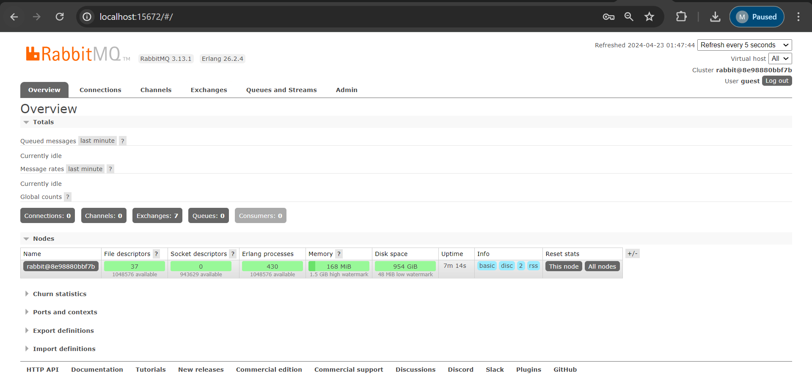
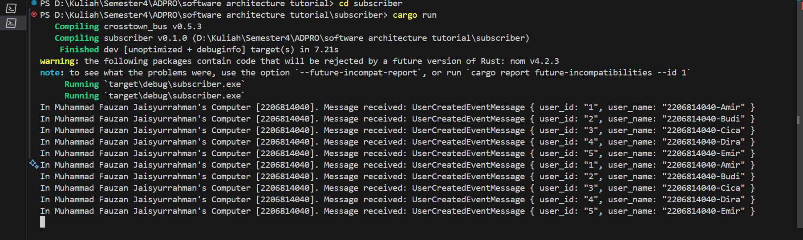
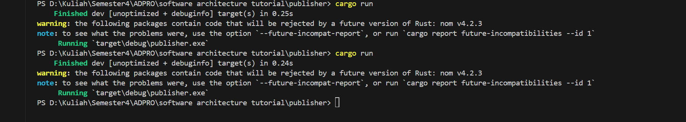
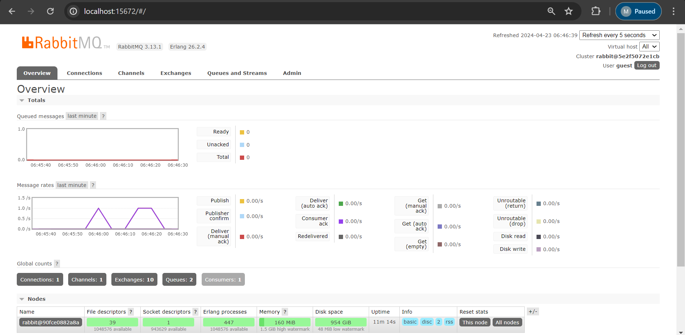

# advprog-module8-publisher

1. 5 kali. Karena publisher melakukan publish_event sebanyak 5 kali.

2. Artinya kedua program tersebut(publisher dan subscriber) terhubung ke server RabbitMQ yang sama.

Screen of running RabbitMQ

# Screenshot terminal

Ini adalah kondisi terminal subscriber ketika menerima 5 event message dari publisher.

Ini adalah kondisi terminal publisher ketika melakukan publish 5 event message.

Ini adalah kondisi interface RabbitMQ ketika publisher melakukan publish event. Dapat dilihat terdapat 1 spike dan terdapat 1 trapesium. Hal ini terjadi karena saya menjalankan publisher 1 kali, kemudian menjalankan publisher 2 kali dalam waktu yang berdekatan.